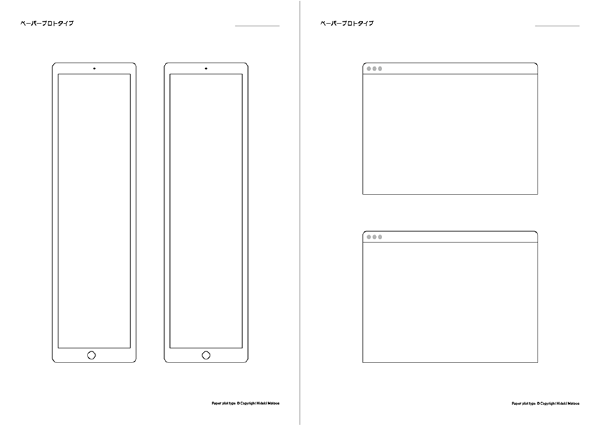
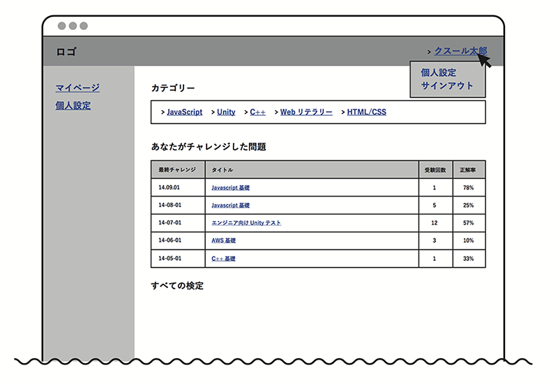
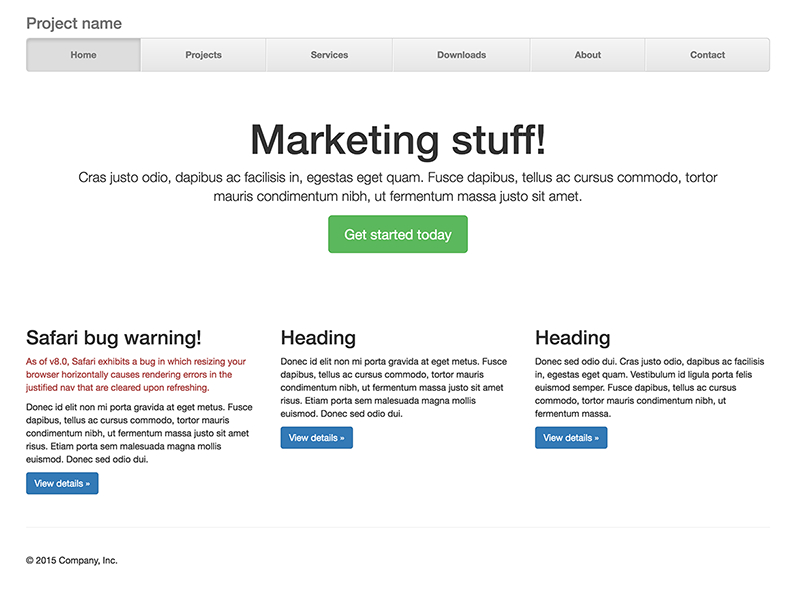

<link rel="stylesheet" href="css/style.css">

## これからのウェブデザイナーの役割

2016/6/21 オロ

#### Webデザインとプロトタイピング  

- **ワークフロー**
	- 従来のデザイナ
	- 今のデザイナ
- **プロトタイピングとは**
	- プロトタイプとは
	- プロトタイプの種類
	- プロトタイプのツールの手法紹介
- **その他デザイナーに求められているもの**
	- デザイナーの関わるUXとは
	- これからのデザイナーに必要な知識

---

---

# 前置き

ウェブデザイナーはデザインしてpsd作って納品するだけじゃないよ。

# Webデザインのワークフロー

UIデザイナーのワークフローを知り、その中で使われている「プロトタイピング」というツールにどんなメリットがあるのかを見ていきましょう。またワークフローの中でUIデザイナーがどうプロダクトのUXに関わることができるのかもご紹介します。

### 従来のワークフロー

サイトマップ、ワイヤー、デザイン →HTMLコーディングが終わってから直しが多い！

まず従来のワークフローとその問題点からお話します。
Webサイト製作などのワークフローは、プランナーやディレクターが企画・設計後にサイトストラクチャーやワイヤーフレームを作成し、それを元にデザイナーが画面のデザインを行うことが一般的です。そして、デザインカンプと呼ばれる完成見本のデザインをクライアントに提出し、フィードバックをデザインに反映した後、コーディングのフェーズに進みます。

流れとしては、企画 > 設計 > デザイン > コーディングというような段階を前の工程に戻らないことを前提に進めているスタイルが多く取られていました。

この開発スタイルの場合、デザインを詰めている、コーディング段階で設計部分の修正が発生した場合など、後半の工程になればなるほど手戻りの工数が増えてしまい、開発途中での変更や修正が困難になってしまう事が問題でした。コーディングまでした制作物をクライアントに見せて、「やはりイメージと違う」と設計やデザインをやり直す経験をされた方も多くいらっしゃるのではないでしょうか？

> 設計  
> デザイン  
> ↓  
> クライアント  
> ↓  
> コーディング

 
 

### これからのワークフロー

サイトマップ、ワイヤー、プロトタイプ、デザイン 途中でプロトタイプを作ることでコミュニケーション
がとれるようになったよ！

従来のワークフローでは、デザインやコーディングに入った後、再度に企画や構成が見直しになった際のリスクや非効率さがあったため、現在では短い期間で素早く開発するスタイルや、初期段階でプロトタイプを作ってテストする方法が主流になってきています。

そのスタイルの中で、「素早く」「早い段階」でサイトやアプリケーションなどプロダクトの模型となるものを作成する「プロトタイピング」という手法が注目されています。この手法は、設計の早い段階で動線や情報、動きなどをクライアントやメンバーに共有することができるため、後半の工程から手順を戻って修正作業に入るリスクを減らせることなどのメリットがあります。

また、プロトタイプは専用のツールを使うことによって、ページ間にリンクを設けて導線を確認したり、ホバーアクションをつけることでより実際の完成物に近い状態でデザインをチェックすることができます。

> 設計  
> プロトタイプ  
> ↓  
> クライアント  
> ↓  
> デザイン  
> コーディング

-----

# プロトタイプ

これからの開発モデルにあった設計やデザインの手法として「プロトタイピング」を出しました。ここでは具体的にどういった手法で、どういったメリットがあり、どう作成すればよいのかを見ていきます。

## プロトタイプとは

プロトタイピングとは、サイトやアプリケーションなどプロダクトの模型となるものの手法やその過程のことで、プロトタイプはその模型を指します。一般的にターゲット（ペルソナ）やユーザーシナリオ、機能一覧、遷移図などの情報を元に作成します。

主にレイアウトの確認、メニュー構成の確認、要素の強弱などの項目を確認します。

モバイルアプリや、モバイルサイトのデザインは、デスクトップのモニタで画面を見るのと、実機でみるのとは印象が全く違うため、ターゲットとなるデバイスでの確認も面倒臭がらずにしましょう。

ワークフローの章でも書きましたが、デザインの前、もしくはコーディングの前に情報や繊維などをクライアントやメンバーと確認できるので、大きく修正作業が発生するリスクが減りことがメリットです。

 
 

## プロトタイプの種類

たくさんのメリットがあるプロトタイプですが、一言でプロトタイプと言ってもいくつかの種類があります。紙と鉛筆のみで画面を設計する「ペーパープロトタイプ」やCSSフレームワークを使い簡易的にページを作ってしまう「HTMLプロトタイプ」などです。用途は、メリット、作成者、どの開発フェーズで使用するかによって変わります。あなたにあったプロトタイプを探してみましょう。

- ペーパープロトタイプ
- ワイヤー
- ビジュアル
- HTMLプロトタイプ

### ペーパープロトタイプ

 

鉛筆と紙を使ってラフに画面設計をつくる手法です。ツールを使わず専門的な知識も必要ないため、ディレクターやエンジニアを交えたような、複数人で画面を設計する際に有効的です。デザインを作成し始めてからでは遅いので、企画や情報設計などの早い段階のフェーズで使用します。早く作成できることがメリットなので、時間をかけて丁寧に描く必要はありません。しかし、最低限に製作者が口頭で説明が無くても理解できるように文字や図を描き入れます。

 

### ワイヤーフレーム形式

ワイヤーフレームのプロトタイプとは、色や細かい装飾などのデザイン面は決めずに大まかなコンテンツやレイアウトを示した構成図のことです。複数人同時ではなく、ディレクターやデザイナーが代表して作成する場合などに、ワイヤーフレーム形式がオススメです。理由は、複数ページのプロトタイプを紙と鉛筆で書くとなると、同じパーツを何度も描く手間がかかりますが、ツールを使うとパーツを複製でき、データとして他のメンバーにも共有することが出来るたっめです。作成の際は、変更・修正が発生することを見越して、修正しやすい構造にすることが必要です。そのため、現在ではProttのようなオンラインで使用するサービスや、Adobe Illustratorなどが一般的に使われています。
 

### デザインカンプ形式

デザインカンプとは、実際の完成形に近いデザインの事を言います。また、静的なデザイン画面で終わりではなく、ページ間の遷移をリンクでつなげたり、トランジションというページを切り替える際のアニメーションを付けます。動作させるより実際のプロダクトに近いものを制作することによって、コーディングする前に導線や情報の優先度、アニメーションなども確認することができます。動的なプロトタイプにするには、Adobe IllustratorやAdobe Photoshopのツールで作ったデザインを使い、InVisionやMarvelのようなオンラインツールでプロトタイピングすることが一般的です。Adobe XDを使えば、デザインからプロトタイピングまでの作業を1つの作業で簡単に行うことができます。

 

### HTMLプロトタイプ（インタラクティブプロトタイプ）

WebサイトやWebアプリケーションを作る際に、設計段階でHTMLデータを作成し、実際に近い形にするプロトタイプです。一からHTMLやCSSを書くのではなく、BootstrapのようなCSSフレームワークを利用して、簡単に早く作成します。ページ間の遷移をリンクでつなげたり、トランジションを付けられることはもちろんですが、そのままHTMLデータを引き継いでコーディングに取り掛かれることがメリットです。

 
 

#### それぞれのプロトタイプの特徴と主要なツール

| タイプ | 職種 | コスト | 機能 | ツール |
|:-----------|:------------|:------------:|:------------:|:------------|
| **ペーパープロトタイプ** | 誰でも | 小 | 低 | Pop/InVision/Marvel/Prott |
| **ワイヤーフレーム** | ディレクター/デザイナー | 中 | 中 | XD/Prott |
| **デザインカンプ** | デザイナー | 大 | 中 | InVision/Marvel/XD/Prott/AfterEffects |
| **インタラクティブプロトタイプ** | デザイナー (製作物によって異なる) | 中〜大 | 高 | HTML/Flint/Pixate/Origami |

## プロトタイピングツール

プロトタイピングツールの種類も多種多様で、Popのようにモバイルだけで完結できるものから、様々なジェスチャに対応した細かいアニメーションを実装できるPixateなどたくさんリリースされています。一概にどれが良いと言えるものはまだ無く、目的によって使い分けることが一般的です。

## プロトタイプで気をつけるべき点

プロトタイピングは基本的に完成物ではないので、時間をかけるべきではありません。設計などの初めの段階で、プロトタイプのデザインやアニメーションを凝らないようにしましょう。細かい装飾や動きに目がいってしまい、大事な設計や情報を判断できなくなってしまうからです。特に早く作れることが売りのペーパープロトタイプの段階で、丁寧に時間をかけて描くような必要性はありません。しかし、ある程度製作者が説明しなくてもわかるレベルのクオリティーは保つようにして下さい。また、ワイヤーフレームタイプのプロトタイプの場合も、用意されたiPhoneやAndroidのUIコンポーネントを使用して効率的に画面を設計します。

---

# 他デザイナーに求められているもの

## デザイナーが関わるUX

UXとは、上記のユーザー体験の一例に出したように、UIデザイナーだけが関わるものではなく、プロダクト開発に携わる全職種の人で作られるものです。ですから、UIデザイナーが関わるUXはその体験の一部にすぎません。

しかし、今まではストラクチャやワイヤーフレームを元にデザインを作ることがデザイナーの役目でしたが、プロトタイプなどの設計段階に携わるように、デザイナーが関わる作業範囲が徐々に広がっています。それは、一連のユーザーの体験をデザインするためにUIだけではなく、情報設計やアニメーションなどの動きまでを含めて考えられたUIを作ることができるスキルが今のUIデザイナーに求められているからです。

 
 

### これからのUIデザイナーに求められること

デザイナーの作業範囲が広がり、ディレクターやプログラマーとの垣根が年々無くなってきている印象です。一度に全てのスキルを持つことはできないので、まずは社内で求められているスキルや、自分のキャリアアップを考えて強みにしたいスキルから勉強していくことをオススメします。

 

- 情報設計
- アニメーション
- UIデザイン
- ラベリング
- コーディング・プログラミング
- 心理学

 
 