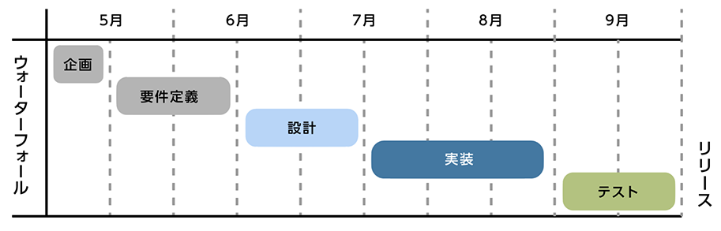
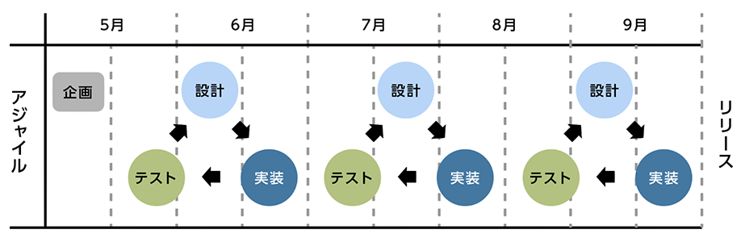
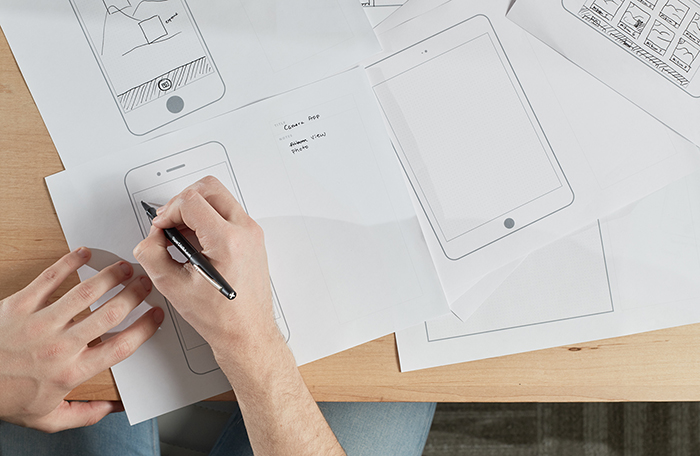
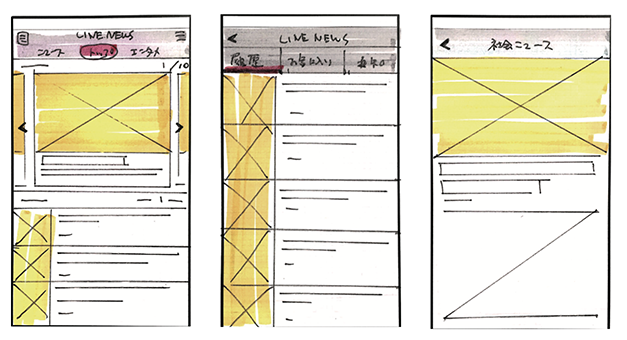
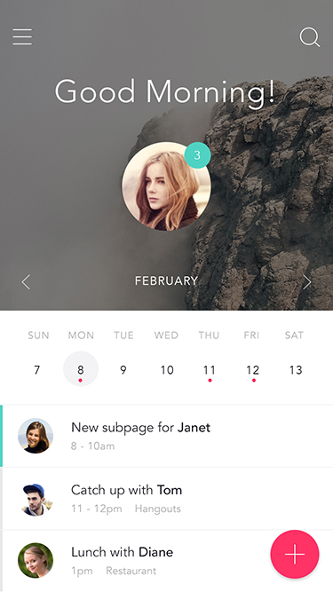

# Adobe XD

## Adobe上条さんの要望
- UX/UIを考えることの面白さを伝える 
- UXが自分に関係するもかもしれないこと（人によってはキャリア）への気づき
- 体系立てて説明するというよりは、興味深いトピックを拾って紹介する方が良い
- 用語を羅列するより、面白いトピックをコラムみたいに書く
- 「ワイヤーフレームとラフデザインをみせてOKがでても、実際のサイトみたら修正がいっぱいきた」みたいな話

## UIデザイナーが関わるUXとは

#### UIデザインとプロトタイピング  

- **UIデザインのワークフロー**
	- 今までとこれからのワークフロー（Web/アプリ）	
	- ディレクター、デザイナー、エンジニアが関わる作業
- **プロトタイピングとは**
	- プロトタイプとは
	- プロトタイプの種類
	- プロトタイプのメリット
	- プロトタイプで気をつける点
- **UXとは**
	- デザイナーの関わるUXとは
	- これからのデザイナーに必要な知識

---

---

# UIデザインのワークフロー

## そもそもUIとは何か？

UIはUser Interfaceの略で、主にコンピューターとその利用者とで情報をやりとりするためのInterface（接点、接触面）の事を言います。身近なものでは、キーボードやマウス、マイク、タッチパネルに当たります。また、パソコンやスマートフォンのディスプレイに表示されるボタンなどもUIです。

数年前までは聞き慣れなかったUIデザイナーという役職ですが、スマートフォンアプリケーションが多く作られるようになると共に一般的に認知されてくるようになりました。
モバイルアプリケーションのUIデザイナーはもちろんのこと、Webアプリケーションや、家電のディスプレイをデザインしている方もUIデザイナーと言われています。

<!--WebデザイナーとUIデザイナーの違い、、、-->

## 従来と今のワークフローの違い	

### 従来

従来は、プランナーやディレクターが企画・設計後にサイトストラクチャーやワイヤーフレームを作成し、それを元にデザイナーが画面のデザインを行いました。そして、デザインカンプと呼ばれる完成見本のデザインをクライアントに提出し、フィードバックをデザインに反映した後、コーディングのフェーズに進みます。

流れとしては、企画 > 設計 > デザイン > コーディングというような段階を前の工程に戻らないことを前提に進めていました。このような開発モデルを下流から上流へは戻らない水の流れにたとえてウォーターフォール型と呼びます。

設計  
デザイン  
↓  
クライアント  
↓  
コーディング

### これから
設計  
プロトタイプ  
↓  
クライアント  
↓  
デザイン  
コーディング

##開発モデル

製作のワークフローが徐々に変わって来ています。
新しいワークフローによって何が変わるのか

従来は、ウォーターフォール型が主流でしたが、

製作段階の早い段階でサイトの動きをみることができるプロトタイプを作成し検証していく

早い段階から、動線や情報、アニメーションなどを確認、回すすることによって、
大きな手順を戻って、修正するリスクを減らします

デザインを静止画で確認するのが一般的でしたが、

デザインを詰めてる、コーディング段階で設計部分の修正が発生した場合に作り直すリスク、非効率さを無くすことができる。

### ウォーターフォール型開発
下流から上流へは戻らない水の流れにたとえてウォータフォールと呼ばれています。
「企画」「案件定義」「設計」「実装」「テスト」といような工程に分けて
順に段階を経て行う方法で、前の工程には戻らない前提です。
テストで不都合が発覚するなど、後半になればなるほど手戻りの工数が増え、開発途中での仕様
変更や追加対応が困難になってしまいます。

<!---->

### アジャイル型開発
アジャイルとは「すばやい」「俊敏な」という意味です。
反復 (イテレーション) と呼ばれる短い開発期間単位を採用することで、リスクを最小化しようと する開発手法の一つです。小単位での「実装→テスト実行」を繰り返し、徐々に開発を進めてい きます。アプリケーションや、Webサービスの現場など競争が激しく、開発スピードが求められ る現場で採用が増えています。

<!---->

#### メリット
不具合が発覚しても手戻り工数を最小限に抑えることができる。
また、仕様変更や追加にも柔軟に対応できる。

#### デメリット
小単位で実装とテスト実行を繰り返すため、全体のスケジュールや進捗が把握しづらく、 マネジメントのコントロールが難しい。一括請負として「決まった機能を”全部”つくること」で ビジネスをしている会社では使うことが難しい。

## デザイナーが関わる作業

今までは、ストラクチャやワイヤーフレームを元にデザインを作るのがデザイナーの役目でしたが、デザイナーが関わる範囲が徐々に広がっています。一連のユーザーの体験をデザインするためにUIだけではなく、情報設計やアニメーションまで含めて関わることが増えてきました。

-----

# プロトタイピング

アジャイル型開発など、短期的でスピーディにテストできる開発ツールとして、プロトタイピングが注目されています。
一般的にモバイルアプリケーションで使用され始めたが、Webアプリやサイトでも使うようになった。
徐々に完成度を上げていく

ペルソナやシナリオ、遷移図などの情報を元に作成します。

モバイルアプリや、モバイルサイトのデザインは、デスクトップのモニタで見るのと、実機でみるのとは印象が全く違う。

## プロトタイプの利点

- その場でのすぐにデザインの共有が出来る
- 早く作ることができる
- 実際のプロダクトと同じような感覚でテストできる
- デザイナー以外も誰でも作れる
- 紙とペンがればできる

紙と鉛筆があればデザイナー以外も作ることができるので、
プランナー、ディレクター、デザイナー、プログラマーなどどの役職の人もディスカッションに参加することができます。

プロダクトの使い勝手を検証できる

いち早く、クライアントやメンバーにアイデアを共有できる

早いから何パターンも作って試せる

未完成なので、デザイナー以外も意見を出しやすい

UI設計
インタラクション
デザインパターン

## プロトタイプの種類

プロトタイプといっても種類が複数あります。
鉛筆で紙にラフに書いたペーパープロトタイピングから、実際のフリックやタップなどのジェスチャに対応し、トランジションをつけより本物に近づけた形のものまで幅広く使われています。

用途や場面に使い分けることができます。

ディレクターや、エンジニアを交えたて画面を設計する際はペーパープロトタイプが良いですが、
デザイナーがプロトタイプを作成するのであれば、XDがオススメです。

例えば複数ページの画面を紙に書くとき、同じパーツを何度も描かないといけなく、また修正する際にも少し手間がかかるので、複製や修正が簡単なツールを使うこともオススメです。

- ラフ、手書き
- ワイヤー
- ビジュアル
- HTMLプロトタイプ

## プロトタイピングツール

モバイルだけで完結できるものから、様々なジェスチャに対応した細かいアニメーションを実装できるものまで多種多様

- XD
- どんなことができるか
	- トランジション
	- 動線のチェック
	- サイズや視認性チェック

## プロトタイプで気をつけるべき点

プロトタイピングは完成物ではないので、時間をかけるべきではない
はやくつくることがポイント

コンポーネントやパーツなどはいちから作成せず、それらを使うことで効率アップさせる。

ある程度説明しなくてもわかるレベルで書き込む
	
	

---
---

# デザイナーの関わるUXとは

## UXとは

Webサイトやアプリケーションを見る前から、実際に使っている最中、その後の行動の体験

ユーザーに適したUIをデザインするためには、ユーザーの感情や思考、心理を考えて画面やデザインを設計する必要があります。

デザイナーに関係するUXとはどういった部分でしょうか？

### ユーザーエクスペリエンス（UX）
Experienceとは「体験、経験」を意味し、UXとは「ユーザーが製品・サービスを通じて得られる体験」を指します。サービスを利用する一連の行動の中で、ユーザーが感じたこと全てがUXになる、 と捉えましょう。例えばWebサイトの場合、デザインがキレイ、フォントが読みやすい、お問い合せフォームや購入ページまでの導線がわかりやすいといった表層的な部分から、商品を注文したら すぐに届いた、対応が丁寧だった、商品のクオリティが高いというようなサービスの質に関わる部 分も「UX」です。

- TVCMを見る
- ECサイトにアクセス
- 商品をブックマーク
- 1週間後に再度アクセス
- 商品購入
- 商品が届く
- SNSでシェア、コメントを書く

などの一連の体験すべてがUX

## これからのUIデザイナーに求められること

情報設計
アニメーション
デザイン
心理学などなど、、、

勉強方法

 
 